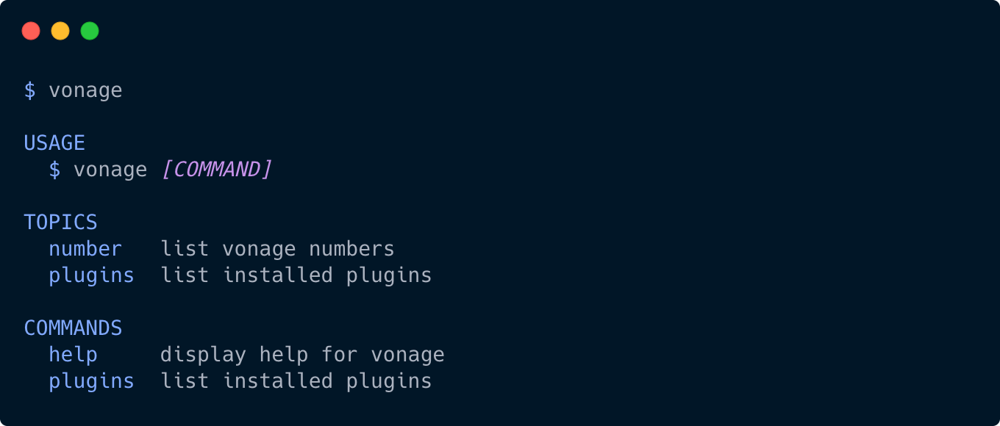

`vonage` is the Vonage command line interface. It allows you to manage your account amd numbers, and configure your applications. It is built using [oclif](https://oclif.io).


<!-- https://carbon.now.sh/?bg=rgba%28171%2C184%2C195%2C0%29&t=night-owl&wt=none&l=text%2Fapache&ds=true&dsyoff=20px&dsblur=68px&wc=true&wa=false&pv=56px&ph=56px&ln=false&fl=1&fm=Hack&fs=14px&lh=133%25&si=false&es=2x&wm=false&code=%2524%2520vonage -->

# Documentation

(coming soon)

# Overview

This is the next generation Node-based Vonage CLI.  The goals of this project were to make contributions easier, plugins more flexible, and make the CLI faster.

This project is built with [lerna](https://lerna.js.org/). The core plugins are located in [./packages](./packages).

The standard `oclif` `./bin/run` script serves as your entry point to the CLI in your local development environment. `./bin/run` is a symlink to the core package `./packages/cli/bin/run`.

## Install and Run from Source

Clone the repository to your local machine and then:

* Run `npm install`
* Run `lerna bootstrap`

You will need to repeat these steps when you change branches or pull fresh code from the repository.

Run `bin/run` to run the tool, in place of the `vonage` command that this project uses when packaged.

# Contributing

If anything feels off, or if you feel that some functionality is missing, please check out the [contributing page][CONTRIBUTING.md]. There you will find instructions for sharing your feedback, building the tool locally, and submitting pull requests to the project.

## Creating a Plugin

To create an [oclif plugin](https://oclif.io/docs/plugins#building-your-own-plugin) and install it to the core package follow these steps.

### Generate a Plugin

Run `npx oclif plugin packages/{plugin-name}` to create a plugin in a new directory.

When naming the package, it should be named `@vonage/cli-plugin-{plugin-name}`.

### Install it to `@vonage/cli`

To run the plugin in the CLI, you need to configure it with lerna as a local package. 

First change directory `cd packages/cli`. Next, run `lerna add @vonage/cli-plugin-{plugin-name} --scope=@vonage/cli` to add the new package to the core.

### Configure `@vonage/cli`

Lastly, add it to the `@vonage/cli` -> `package.json` file.

```js
{
  "name": "@vonage/cli",
  // ...
  "oclif": {
    "commands": "./lib/commands",
    "bin": "vonage",
    "plugins": [
      "@oclif/plugin-help",
      "@oclif/plugin-plugins",
      "@vonage/cli-plugin-numbers",
      "@vonage/cli-plugin-auth"
    ]
  }
}
```
